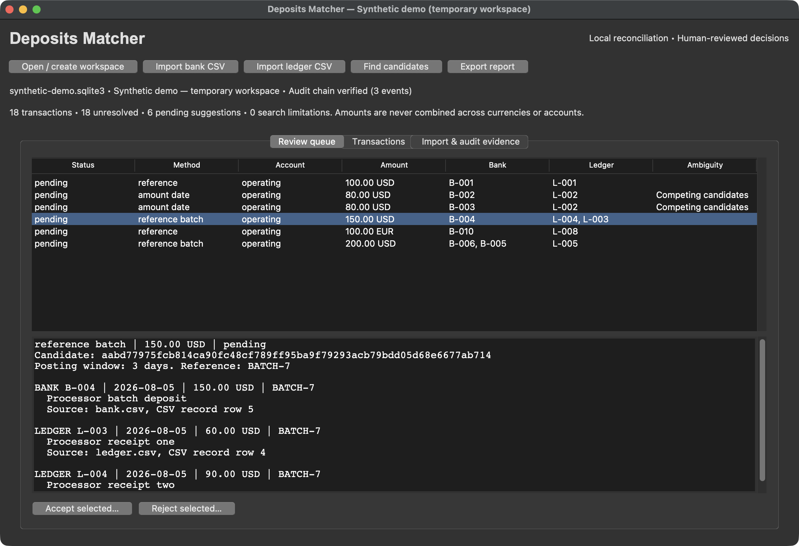

# Deposits Matcher

[](https://github.com/bgivenb/Deposits-Matcher/actions/workflows/test.yml)

A local-first reconciliation workbench for comparing bank deposits with ledger receipts. Import statements, inspect exact and reference-backed batch suggestions, resolve competing candidates, and export the evidence behind each recorded decision.

**Equal totals are not proof of a match.** The engine proposes; a person accepts or rejects. It never posts to a bank or ledger, and no statement data leaves the computer.



## What changed in 3.0

The original two-list calculator remains available. The new workbench adds the context that amount-only matching lacks:

- **Identity and provenance:** stable source/account/record IDs, file SHA-256 receipts, CSV-row lineage, atomic imports, and replay-safe deduplication. Conflicting reused IDs fail the entire import.
- **Explainable proposals:** integer-cent amounts, posting-date windows, exact references, and account/currency boundaries. Batches require a shared reference.
- **Ambiguity without guessing:** competing candidates remain visible. No confidence percentage or greedy winner hides uncertainty.
- **Conflict-safe review:** immutable reviewer/reason records and transactional allocations prevent accepted matches from consuming the same transaction twice.
- **Persistent evidence:** SQLite transactions, restart recovery, a hash-linked event journal, and JSON/CSV exports. Search limits and unevaluated records remain explicit.
- **Two interfaces, one core:** native Tk review workbench and automatable CLI; no server, model key, or runtime package dependency for the CLI.

## Try the synthetic example

Requires Python 3.11 or newer. Run from a source checkout:

```bash
python scripts/demo.py
```

Expected: **18 transactions, 6 proposals, 2 competing proposals, 1 explicitly simulated reviewer acceptance, 4 audit events, and a verified reopen**. The temporary workspace is deleted afterward. Fixtures include exact receipts, both batch directions, duplicate amounts, conflicting references, late postings, and separate USD/EUR balances.

### Desktop review

```bash
python workbench.py
```

Use a Python distribution with Tkinter. On Debian/Ubuntu, `python3-tk` supplies Tk for the system interpreter.

For an automatically loaded, disposable synthetic workspace, run `python scripts/preview.py`.

1. Open/create a workspace in a private directory outside the repository.
2. Import `examples/bank.csv` and `examples/ledger.csv` with the corresponding buttons.
3. Choose **Find candidates** and a posting-date window; the default is three days.
4. Inspect a candidate's records, dates, references, original filenames, and CSV-row lineage. Two unidentified USD 80 deposits intentionally compete for one receipt.
5. Accept or reject with a reviewer name and reason. This is a local review record, not a bank/ledger posting. Decisions cannot be reversed in this version.
6. Export a new JSON evidence report or a formula-safe transaction CSV.

### CLI

```bash
python -m reconcile --db /private/path/review.sqlite3 import bank examples/bank.csv
python -m reconcile --db /private/path/review.sqlite3 import ledger examples/ledger.csv
python -m reconcile --db /private/path/review.sqlite3 match --window-days 3
python -m reconcile --db /private/path/review.sqlite3 report
```

After inspecting the evidence, use the full candidate ID from the report:

```bash
python -m reconcile --db /private/path/review.sqlite3 decide CANDIDATE_ID accept \
  --actor "Reviewer name" --reason "Verified the receipt reference against source records"
python -m reconcile --db /private/path/review.sqlite3 verify
python -m reconcile --db /private/path/review.sqlite3 export /private/path/review.json
python -m reconcile --db /private/path/review.sqlite3 export /private/path/review.csv --format csv
```

Replace `/private/path` with an existing directory. Commands return JSON; validation/storage failures exit with code 2. Exports refuse existing files. `pip install .` additionally installs the `deposits-reconcile` command.

## Input contract

UTF-8 CSV, optionally with a BOM. Required headers: `id,date,amount,currency,account,reference`; `description` is optional. Unknown or duplicate columns are rejected.

```csv
id,date,amount,currency,account,reference,description
B-001,2026-08-03,100.00,USD,operating,INV-100,Customer invoice settlement
```

- IDs are stable within a source/account; bank and ledger IDs are independent.
- Account is an explicit common reconciliation scope. Map differently named bank/ledger accounts before importing; mapping is never inferred.
- Posting dates use valid `YYYY-MM-DD`; no timezone conversion is inferred.
- Amounts are positive deposits, at most two decimal places and 12 integer digits. No rounding, exponents, reversals, or fractional cents. Commas must be correctly grouped; dollar prefixes require USD.
- Currency is an uppercase three-letter label. No FX conversion or currency-registry validation is performed; non-two-decimal currencies are out of scope.
- References are trimmed, case-sensitive strings. Empty references permit amount/date-only review suggestions, never batch matching.
- Limit: 5 MB and 5,000 records per file. A reused ID with changed content is an error, not an update.

## Search policy and limits

One-to-one matching uses an amount index. Two nonempty conflicting references disqualify a pair. The inclusive posting window is configurable from 0–31 days.

One-to-many/many-to-one batches require a shared nonempty reference, exact totals, and each component within the anchor's posting window. At most four components are considered from a pool of twelve. Many-to-many matching, fee inference, fuzzy identity, and automatic approval are intentionally absent.

Each run accepts at most 10,000 unresolved records, evaluates at most 100,000 comparisons, and retains at most 10,000 proposals. Limits are exported and shown in the workbench. **No pending candidate does not prove no match exists.** Unevaluated, budget-limited, competing, and awaiting-review records have distinct review states.

Rejections persist under the same policy version/date window. Accepted records are excluded from subsequent searches; evidence remains available. A changed policy/window creates distinct proposal IDs and can surface previously rejected relationships.

## Verify and develop

```bash
python -m unittest discover -s tests -v
DEPOSITS_GUI_TEST=1 python -m unittest discover -s tests -p test_workbench.py -v
python scripts/demo.py
python scripts/benchmark.py
```

GUI tests require a display; Linux CI runs them under Xvfb. Tests cover value conservation, seeded permutation invariance, search budgets, import replay/rollback, allocation races, restart persistence, journal corruption, CSV formula injection, and real Tk review actions.

See [design and invariants](docs/DESIGN.md), [measured performance](docs/PERFORMANCE.md), and [security boundaries](SECURITY.md).

## Original calculator and historical binaries

`python depositsmatcher.py` runs the original amount-only calculator; its maximum-subset search remains limited to 20 entries per list. Install `requirements.txt` only for that calculator's Excel export. Its matches are mathematical equalities, not reference-backed reconciliation decisions.

The two root-level macOS ZIPs are historical snapshots, retained unchanged. They do not contain the 3.0 workbench. Use source or versioned release artifacts; no new notarized desktop executable is claimed.

## Scope and license

An independent portfolio and hobby project with synthetic public examples—not employer code, a bank integration, an accounting system of record, or a compliance certification. Review financial conclusions independently.

The existing [CC BY-NC 4.0 license](LICENSE) is retained. It restricts commercial reuse and is not a conventional open-source software license; check its terms before reuse.
